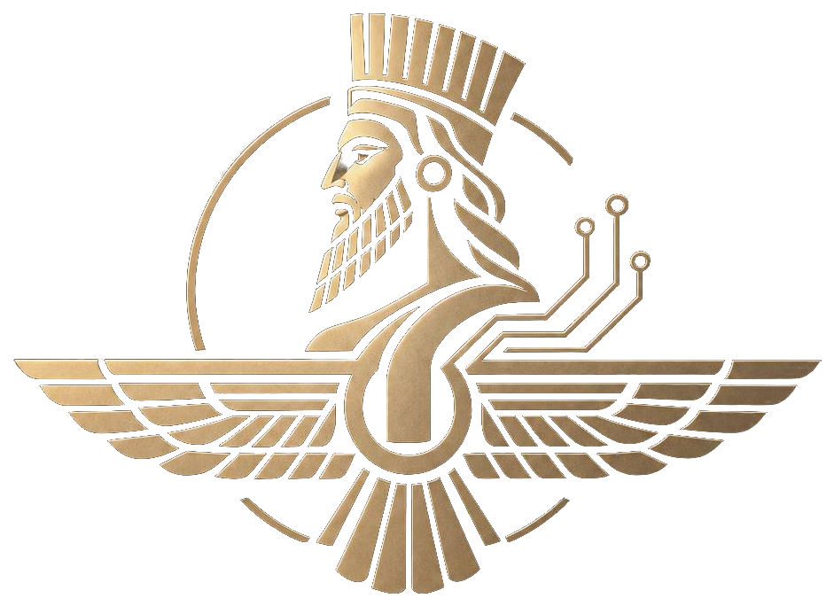

<div align="center">


<br>

<a href="https://github.com/mamirabadi1389-lang">

</a>
<a href="https://t.me/@Pyforever4554">

</a>

<br><br>


<br><br>


</div>

---

## About Me

```python
class MohammadAmirabadi:

    def __init__(self):
        self.name = "Mohammad Amirabadi"
        self.role = "Python Developer"

        self.interests = [
            "Python Development",
            "Machine Learning",
            "Data Analysis",
            "Database Systems",
            "Web Development"
        ]

    def goal(self):
        return "Learn, build, and improve."
```

I'm a Python developer interested in machine learning, data analysis, and building practical applications.

I enjoy learning new concepts, solving problems, and turning ideas into working projects.

---

## Tech Stack

<div align="center">


<br><br>


</div>

---

## Featured Projects

<table>
<tr>
<td width="50%" valign="top">

<a href="https://github.com/mamirabadi1389-lang/gesture-volume-control">

</a>

### Hand Gesture Control

A Python application that controls Windows volume using hand gestures.

**Technologies**

`Python` `OpenCV` `MediaPipe`

<a href="https://github.com/mamirabadi1389-lang/gesture-volume-control">View Repository ↗</a>

</td>
<td width="50%" valign="top">

<a href="https://github.com/mamirabadi1389-lang/Cancer-diagnosis">

</a>

### Cancer Diagnosis

A machine learning classification project focused on cancer-related data.

**Technologies**

`Python` `Machine Learning`

<a href="https://github.com/mamirabadi1389-lang/Cancer-diagnosis">View Repository ↗</a>

</td>
</tr>
<tr>
<td width="50%" valign="top">

<a href="https://github.com/mamirabadi1389-lang/pandas_and_MongoDB">

</a>

### Pandas & MongoDB

A project for processing CSV files and importing data into MongoDB.

**Technologies**

`Python` `Pandas` `MongoDB`

<a href="https://github.com/mamirabadi1389-lang/pandas_and_MongoDB">View Repository ↗</a>

</td>
<td width="50%" valign="top">

<a href="https://github.com/mamirabadi1389-lang/daily_planner">

</a>

### Daily Planner

A Python application for organizing daily tasks and activities.

**Technologies**

`Python`

<a href="https://github.com/mamirabadi1389-lang/daily_planner">View Repository ↗</a>

</td>
</tr>
</table>

---

## Currently Learning

<div align="center">


</div>

---

## GitHub Statistics

<div align="center">
<br><br>


</div>

---

<div align="center">


<br>



<br>

### KOUROSH SYSTEM

<sub>Personal Brand & Software Projects</sub>

<br><br>

<code>BUILD · LEARN · IMPROVE</code>

<br><br>

<sub>Thanks for visiting my profile.</sub>

</div>
